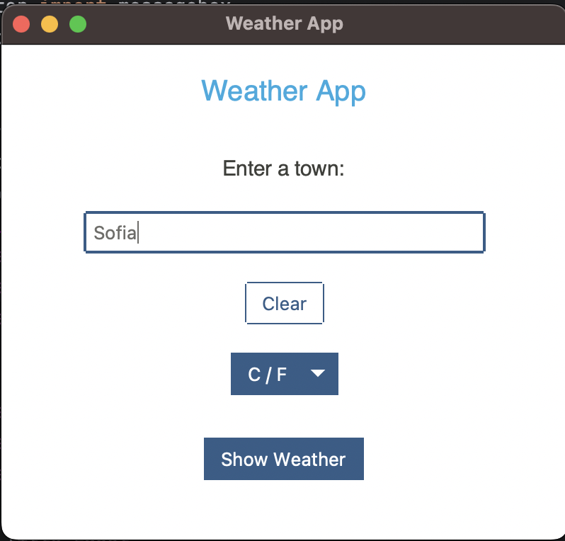
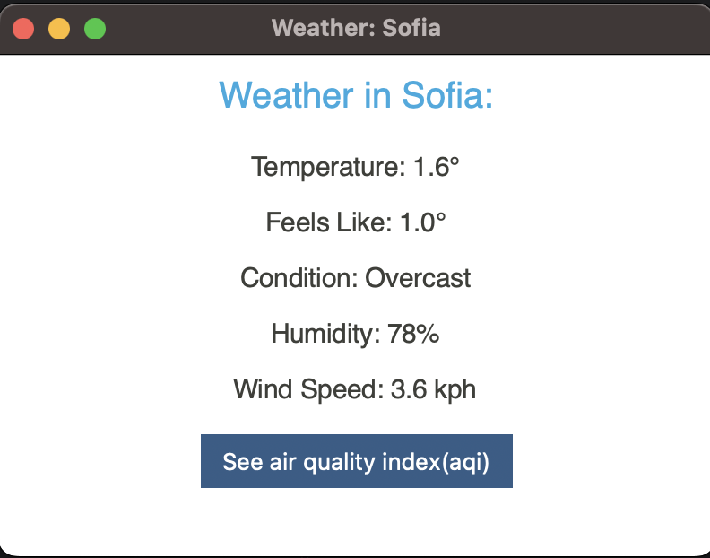
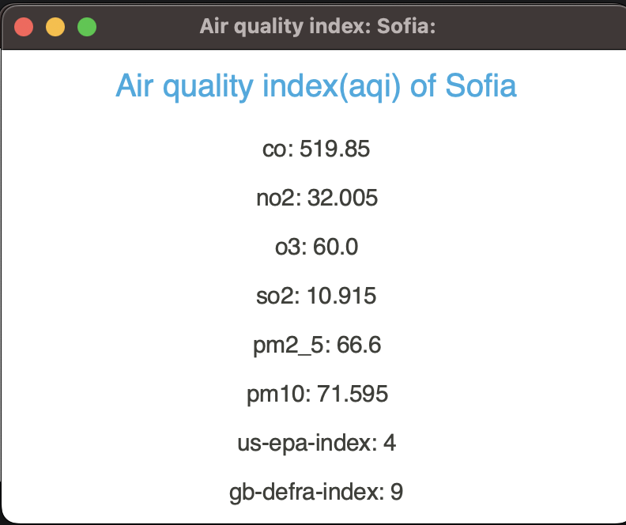
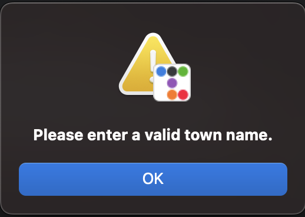
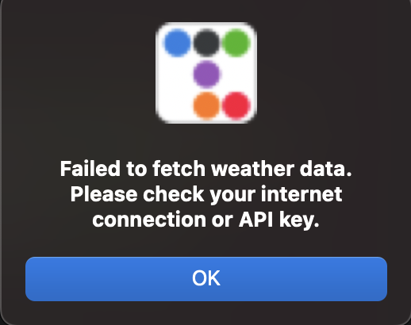

# Weather-App
A simple, interactive weather application built with Python and ttkbootstrap to fetch and display current weather and 
air quality information for any town using the [WeatherAPI](https://www.weatherapi.com/).

## Features:

- Responsive UI:
Built using `ttkbootstrap`, providing a modern, user-friendly interface.
- Weather Information:
Displays temperature (Celsius or Fahrenheit), feels-like temperature, weather condition, humidity, and wind speed.
- Air Quality Index (AQI):
Provides detailed AQI data for the selected town.
- Temperature Unit Selector:
Easily switch between Celsius (°C) and Fahrenheit (°F).
- Clear Input:
Clear the entered town name with a single click.

## Prerequisites:
To run this application, you need the following:

- Python 3.7 or later
- `ttkbootstrap` library
- `requests` library
- A valid API key from [WeatherAPI](https://www.weatherapi.com/)

## Installation:

1. Clone the Repository:
```bash
git clone <repository-url>  
cd <repository-directory>  

```
2. Install Dependencies:
Install the required Python libraries using pip:
```bash
pip install ttkbootstrap requests  
```
3. Update the API Key:
Replace the placeholder API key in the code (`85dbfaf9e0b443378b4142616243112`) with your own API key from WeatherAPI.
4. Run the Application:
Execute the following command in your terminal:
```bash
python weather_app.py  
```

## Usage:
1. Open the app.
2. Enter the name of the town in the input field.
3. Choose the desired temperature unit (Celsius or Fahrenheit).
4. Click Show Weather to view the current weather details.
5. For AQI details, click the "See air quality index (AQI)" button in the weather details window.

## Screenshots:





## Error Handling:




## Contribution:
Feel free to contribute to the project by submitting issues or creating pull requests.

1. Fork the repository.
2. Create a new branch.
3. Make your changes and commit them.
4. Push to your forked repository.
5. Open a pull request.

## License:
This project is licensed under the MIT License.
